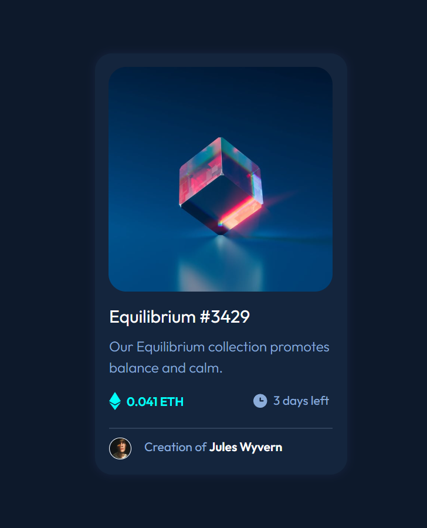

# Frontend Mentor - NFT preview card component solution

This is a solution to the [NFT preview card component challenge on Frontend Mentor](https://www.frontendmentor.io/challenges/nft-preview-card-component-SbdUL_w0U). Frontend Mentor challenges help you improve your coding skills by building realistic projects.

## Table of contents

- [Overview](#overview)
  - [The challenge](#the-challenge)
  - [Screenshot](#screenshot)
  - [Links](#links)
- [My process](#my-process)
  - [Built with](#built-with)
  - [What I learned](#what-i-learned)
  - [Useful resources](#useful-resources)
- [Author](#author)

## Overview

### The challenge

Users should be able to:

- View the optimal layout depending on their device's screen size
- See hover states for interactive elements

### Screenshot

### Links

- Live Site URL: [Add live site URL here](https://your-live-site-url.com)

## My process

### Built with

- Semantic HTML5 markup
- CSS custom properties
- Flexbox
- (https://getbootstrap.com/) Bootstrap v5.2
- (https://fonts.google.com/) Google Fonts

### What I learned

I learnt how to overlay an icon on the image which gets triggered when you hover above it. I also learnt that it is not possible to put line break on a card component so you have to put div with some height.

### Useful resources

- (https://www.w3schools.com/howto/howto_css_image_overlay_icon.asp) - This helped me on overlaying an icon on an image.

## Author
- Frontend Mentor - [@harshithrao07](https://www.frontendmentor.io/profile/harshithrao07)
- Instagram - [@harshith._.rao](https://www.instagram.com/harshith._.rao)
